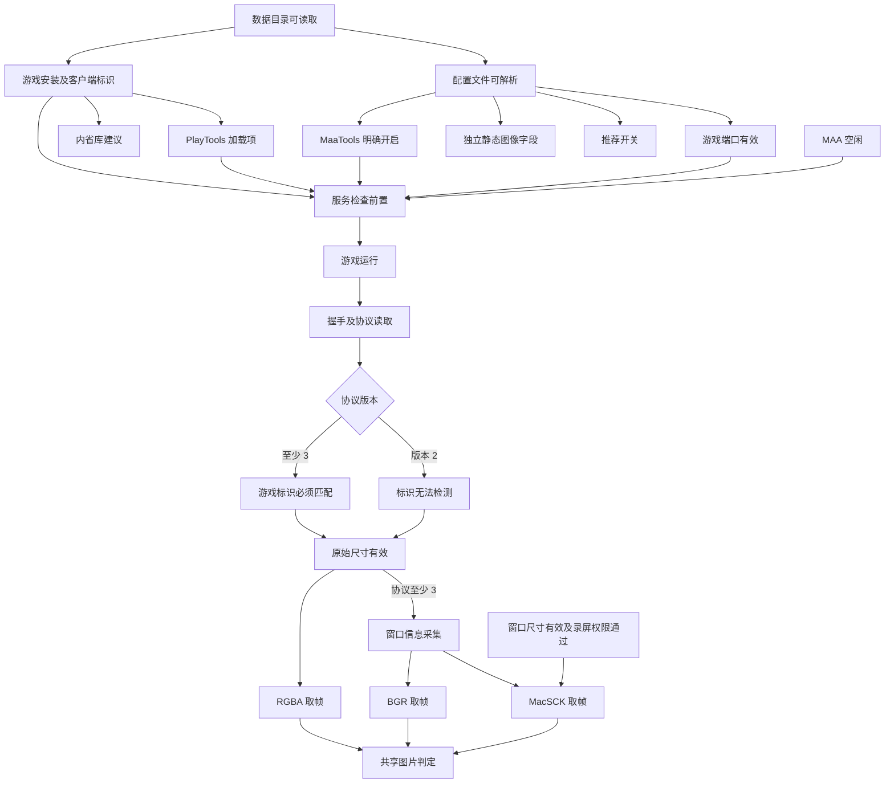

# PlayCover 环境检测的检查依赖

检测按前置条件执行，不按“前面出现任何错误就停止”的顺序执行。只把实际执行后确定失败的项目标为错误；前置不满足的项目保持“无法检测”，当前值为“已跳过”，说明原因，并在 `blockedBy` 中记录阻断项目。未知、未完成或读取失败均不能充当已通过的前置条件。

## 静态检查

| 检查项 | 必需前置 | 失败或未知时的影响 |
| --- | --- | --- |
| PlayCover 应用目录 | 默认路径或用户选择的应用路径可读取 | 跳过发行信息、随附 PlayTools；游戏与 MAA 检查继续 |
| MAA 版本：版本号包含 maa | 应用目录可读取、Info.plist 可解析 | 版本号不含 maa 时报告错误，版本号不可读取时报告无法检测，不阻断已安装游戏的配置或实际协议验证 |
| 随附 PlayTools | 应用目录可读取、框架文件可读取且非空 | 不推断已安装游戏是否有 PlayTools；加载项另行检查 |
| PlayCover 数据目录 | 默认路径或用户选择的数据路径可读取 | 只报告目录的根因；跳过游戏安装、配置及其子项 |
| 游戏安装、客户端标识与可执行文件名 | 数据目录可读取、当前客户端对应的游戏 Info.plist 可解析 | 跳过加载项、内省库、启动动作与运行链路；已有配置文件仍可独立检查 |
| PlayTools 加载项 | 游戏安装通过、可执行文件的 Mach-O 加载项可解析 | 缺失为错误，无法读取为无法检测；均阻断 MaaTools 运行链路 |
| 内省库 | 游戏安装通过、Info.plist 的 LSEnvironment | 缺少为警告，不阻断协议或图片检查 |
| 游戏配置文件 | 数据目录可读取、当前客户端的 plist 为可解析字典 | 只报告此根因；开关、端口和图像配置全部跳过；不连接 MaaTools |
| MaaTools 开关 | 配置文件可解析、该字段类型正确 | 关闭为错误，缺失为无法检测，错误类型为错误；均不连接服务或等待服务启动 |
| MaaTools 端口 | 配置文件可解析、该字段为有效整数 | 非法为错误，缺失为无法检测；阻断端口比较、服务等待和运行链路 |
| PlayChain、绕过越狱检测 | 配置文件可解析、各自字段类型正确 | 关闭或缺少推荐开关为警告；不阻断服务、原始尺寸与截图 |
| 分辨率模式 | 配置文件可解析、resolution 字段 | 独立判断；自动/自由缩放提示运行验证；不阻断实际截图 |
| 配置宽高 | 配置文件可解析、windowWidth 与 windowHeight 字段 | 独立判断；非法为错误，但仍可验证实际运行尺寸 |
| 分辨率缩放 | 配置文件可解析、customScaler 字段 | 独立判断有限正数，不要求 1.0；不阻断实际截图 |
| 显示旋转 | 配置文件可解析、displayRotation 字段 | 独立判断，不阻断实际截图 |
| MAA 触控模式 | 检测开始时的配置快照 | 模式错误单独报告；只读的 MaaTools 协议与截图验证不依赖触控设置 |
| MAA 连接地址格式 | 配置快照 | 格式错误时跳过该地址；有效的本机游戏端口仍独立检测 |
| Core 地址兼容性 | 地址格式通过 | 当前 Core 不支持 IPv6 的 host:port 解析；单独报告错误并建议 localhost/127.0.0.1；诊断客户端仍可独立探测 IPv6 |
| MAA 地址与游戏端口匹配 | 地址格式通过、游戏配置端口通过 | 不匹配为错误；分别探测配置地址与本机游戏端口，回环等价地址只探测一次 |
| MAA 截图模式 | 配置快照 | 模式无效时只跳过截图及对应窗口采集；服务、标识和基础尺寸仍可检测 |
| 录屏权限 | 当前模式为 MacSCK | 拒绝为错误；只阻断 MacSCK 窗口枚举、截图流与画面获取，不阻断握手、标识和协议尺寸 |
| MAA 任务状态 | 检测开始时的任务状态 | 任务运行时只执行静态检查，不启动游戏、不连接服务、不截图 |

配置按字段分别解析。一个图像字段类型损坏只影响该图像项目，不会使有效的 MaaTools 开关、端口一起丢失；一个开关损坏也不会取消其他可读的静态图像检查。

## 运行检查与用户动作

服务检查共同依赖：**MAA 空闲、数据目录可读、游戏安装通过、配置文件可解析、PlayTools 加载项通过、MaaTools 明确开启、游戏端口有效**。任一前置错误、未知或未完成，整个服务与截图分支跳过，不创建连接，也不等待超时。

| 检查或动作 | 必需前置 | 执行与跳过规则 |
| --- | --- | --- |
| 用户点击启动游戏 | MAA 空闲、游戏安装通过 | 先查进程，已运行则不重复启动；该显式动作本身不要求 MaaTools 已开启 |
| 启动后等待 MaaTools | 服务共同前置通过、此次确实启动了游戏 | 最多 20 秒；前置失败立即跳过等待；失败只记录服务等待错误，后续不再连接或截图 |
| 游戏进程 | 服务共同前置通过 | 未运行只报告此状态，服务与截图跳过；不会自行启动游戏 |
| MaaTools 握手、读取协议 | 服务共同前置通过、游戏运行、该探测地址格式有效 | 错误握手、断连、超时等只报告当前阶段错误；协议、身份、尺寸、窗口与截图均跳过 |
| MaaTools 协议兼容性 | 握手及协议读取成功 | 基础尺寸要求 ≥2；RGBA ≥2；BGR/MacSCK ≥3。截图协议不足不取消仍受支持的基础尺寸读取 |
| 游戏标识 | 协议 ≥3 | 不匹配或读取失败时不再获取该服务的尺寸、窗口或画面；另一个探测地址独立执行 |
| 协议 v2 的游戏标识 | 协议读取成功 | 明确标为无法检测；保留旧协议的 RGBA 尺寸和图片验证，不把目标身份视为已通过 |
| 原始分辨率 | 协议 ≥2；≥3 时游戏标识必须匹配 | 非正数或非法数据为尺寸错误；超过检测内存上限为无法检测；停止后续采集，不产生截图错误 |
| BGR 窗口与内容信息 | 原始分辨率已读取、协议 ≥3、BGR 模式 | 与原指南共用采集流程；RECT 传输失败时不发送 BGR 请求 |
| BGR 窗口尺寸值 | RECT 传输完成 | 非法尺寸单独报告错误；BGR 图片判定依赖像素和原始尺寸，可继续独立执行 |
| BGR 图片 | 支持 BGR 的协议、原始尺寸有效、共享流程中的 RECT 请求完成 | 获取 BGR 并调用共享转换和图片判定；图片损坏只报告实际截图错误 |
| RGBA 图片 | 支持 RGBA 的协议、原始尺寸有效、身份检查未发现错误 | 不依赖 RECT、窗口裁剪或录屏权限；验证像素长度后调用共享判定 |
| MacSCK 窗口与内容尺寸 | 原始尺寸已读取、协议 ≥3、身份匹配 | 尺寸无效时不开始窗口匹配或截图 |
| MacSCK 游戏窗口匹配及一帧获取 | 支持 MacSCK 的协议、身份匹配、原始尺寸有效、RECT 尺寸有效、录屏权限通过 | 按游戏标识与当前探测端口匹配窗口，沿用 Core 的裁剪规则；找不到窗口或取帧失败只报告截图阶段错误 |
| 图片完整性、尺寸一致、16:9、最低 1280×720 | 对应截图模式获取到完整图片、原始尺寸有效 | 共用分辨率指南的结论；未得到图片时均不判为通过 |
| 取消/关闭页面/MAA 开始任务 | 检测进行中 | 终止等待或请求，释放连接与截图流；已保存的静态结果保留，未完成项目不得通过 |

静态图像配置、推荐开关、MAA 版本标记以及当前 MAA 触控模式不属于服务运行的硬前置。保留这些错误或警告，继续取得实际协议与图片证据，有助于判断配置是否已生效以及具体失败位置。

## 验证

模拟服务记录实际命令，验证握手失败、协议不足、错误标识、非法尺寸、RECT 截断后不会发送被阻断的后续请求。模型测试验证 MaaTools 关闭/未知、端口错误、注入缺失、配置损坏、游戏缺失、MAA 忙碌时连接和等待调用数为零；验证图像字段或推荐开关错误不阻断独立服务检查，MacSCK 权限拒绝不启动截图流，双地址分别探测。
